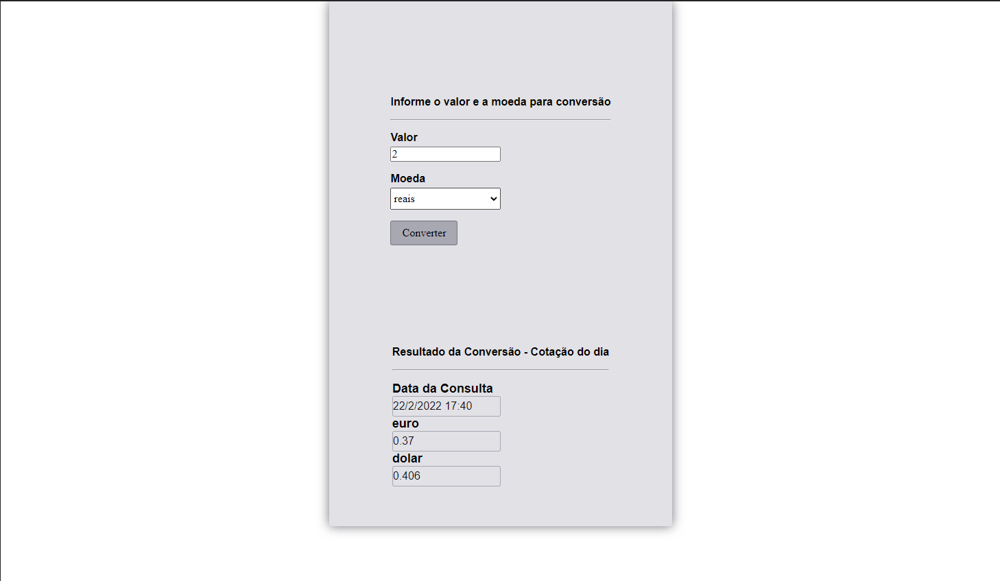
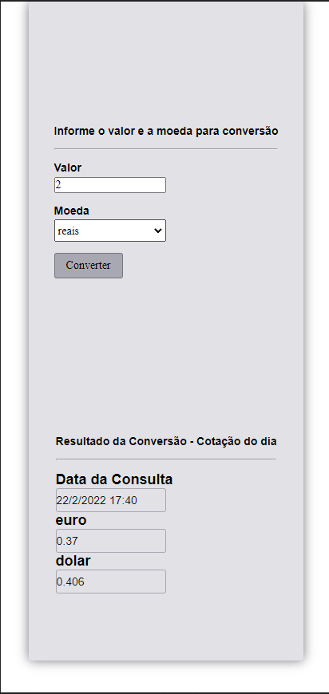

# Currency Conversor.

Esta é uma solução para o criar um conversor de moedas, suporte conversões em Euro, Dólar e Reais.

## :dart: Resumo de conteúdos

- [Visão Geral](#Visão-Geral)
  - [O desafio](#O-desafio)
  - [Captura de tela](#Captura-de-tela)
  - [Links](#Links)
- [Meu processo](#Meu-processo)
  - [Construído com](#Constrído-com)
  - [O que eu aprendi](#O-que-eu-aprendi)
  - [Continuação dos desenvolvimentos](#Continuação-dos-desenvolvimentos)
  - [Recursos utilizados](#Recursos-utilizados)
- [Autor](#Autor)

## Visão Geral.

### :globe_with_meridians: O desafio

Os usuários devem ser capazes de:

- Visualizar o layout ideal para o aplicativo, dependendo do tamanho da tela do dispositivo.
- Visualizar os estados de foco para todos os elementos interativos na página.
- Conseguir adicionar valores para conversão.
- Conseguir selecionar as moedas para conversão.
- Conseguir visualizar o valor das moedas convertidas.

### Captura de tela

- Desktop
<p  align="center" >
  
</p>

- Tablet
<p  align="center" >

</p>

- Mobile
<p  align="center" >

</p>

- Gif
<p  align="center" >

</p>

### Links

- Solução URL: [https://github.com/michelwene/Advice-Generatorp](https://github.com/michelwene/Advice-Generator)
- Site URL: [https://advice-generator-9qntgsq9w-michelwene.vercel.app/](https://advice-generator-9qntgsq9w-michelwene.vercel.app/)

## :page_with_curl: Meu processo

### Construído com

- NextJS
- Typescript
- Axios
- Styled-Components
- Design responsivo

### :bulb: O que eu aprendi
```typescript
type Coins = "EURBRL" | "EURUSD" | "USDBRL" | "USDEUR" | "BRLEUR" | "BRLUSD";

type ICoins = {
  [key in Coins]: {
    bid: string;
  };
}; // tipagem do useState pertencente aos currencys e tipagem dos currecyns na função selectCoin.

const {
    register,
    handleSubmit,
    watch,
    formState: { errors },
  } = useForm({
    resolver: yupResolver(valueSchema),
  }); // utilizando do react-hook-form para utilizar no formulário de preenchimento do valor pegando o valor do campo e registrar as options do select que dentro dele estarão as moedas utilizadas para conversão.
```

### Continuação dos desenvolvimentos

Pretendo continuar fazendo projetos do FrontendMentor, para melhorar meus conhecimentos em ReactJS e TypeScript, posteriormente, utilizar NextJS.

### Recursos utilizados

- [PerfectPixel](https://www.welldonecode.com/perfectpixel/) - Plugin do google Chrome utilizado para servir de refência na construção do layout, funciona mais ou menos como um FIGMA.
- [Developer Mozilla](https://developer.mozilla.org/en-US/docs/Web/JavaScript) - A documentação do Developer Mozilla é essencial para compreender as funções e conseguir aplicar as mesmas no projeto.
- [Advice Slip](https://api.adviceslip.com/) - Esta é uma API que eu consumi para pegar as frases de conselho. 

## 	:medal_military: Autor

- Frontend Mentor - [@michelwene](https://www.frontendmentor.io/profile/michelwene)
- Linkedin - [@michelwene](https://www.linkedin.com/in/michelwene/)
